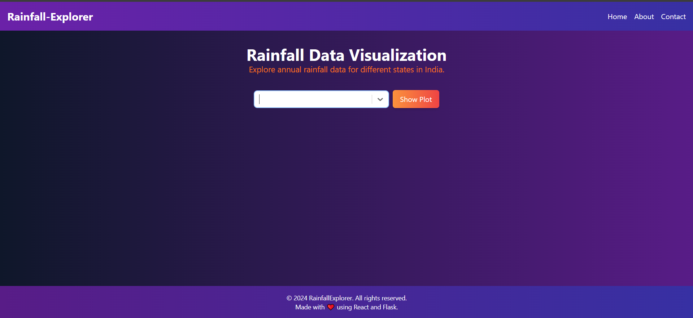

# ☔ Rainfall Explorer

## 🌍 Overview
- **Rainfall Explorer** is a web application that allows users to explore annual rainfall data for different states in India. The application provides **interactive visualizations** and **beautiful charts** to help users analyze and understand rainfall patterns over time.
---
## 🌟 Frontend Preview

---
This project consists of both **frontend** and **backend** components. The frontend is built using **React**, while the backend is developed with **Flask**. The data is fetched from a **RESTful API** and displayed in an intuitive and user-friendly interface.

## ✨ Features

- 🎨 **Easy to Use**: The user-friendly interface makes it simple for researchers, students, and enthusiasts to explore rainfall data for any state in India.

- 📊 **Interactive Visuals**: Dynamic visualizations and charts provide a fun way to analyze rainfall patterns and trends.

- 🔍 **Data Insights**: Gain valuable insights from rainfall data and discover meaningful trends over time.

## 🎯 Goals

- Our mission at **Rainfall Explorer** is to provide easy access to comprehensive rainfall data, enabling users to make informed decisions and gain insights from the data. We aim to deliver an intuitive and visually appealing experience that encourages users to explore and interact with the data.
---
## ⚙️ Installation and Setup

1. 📥 Clone the repository from GitHub.

2. Navigate to the `frontend` directory and run the following command to install frontend dependencies:
   ``` 
   npm install 
3. Start the frontend development server:
    ```
      npm start
4. In a separate terminal, navigate to the backend directory and create a virtual environment:
   ```
   python -m venv venv
5. 🖥️ Activate the virtual environment:

- On Windows:
   ```
   venv\Scripts\activate
- On macOS and Linux:
  ``` 
  source venv/bin/activate
6. Install backend dependencies:
   ```
   pip install -r requirements.txt
7. Start the backend server:
   ```
   python app.py
8. 🌐 Open your web browser and access the application at `http://localhost:3000/`

---
## 🛠️ Technologies Used
- Frontend: React, HTML, CSS
- Backend: Flask, Python
- Data Visualization: Plotly.js
- REST API: For making API requests
      
